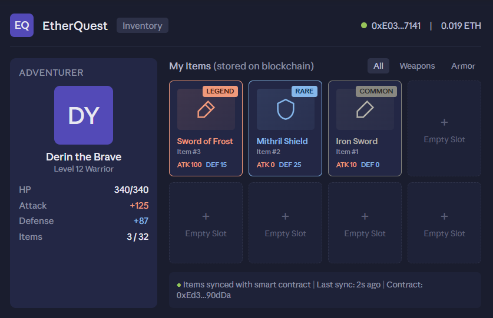
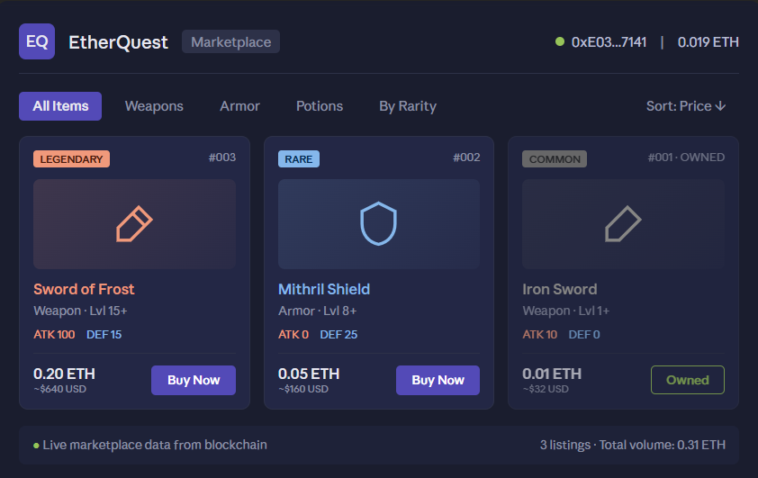
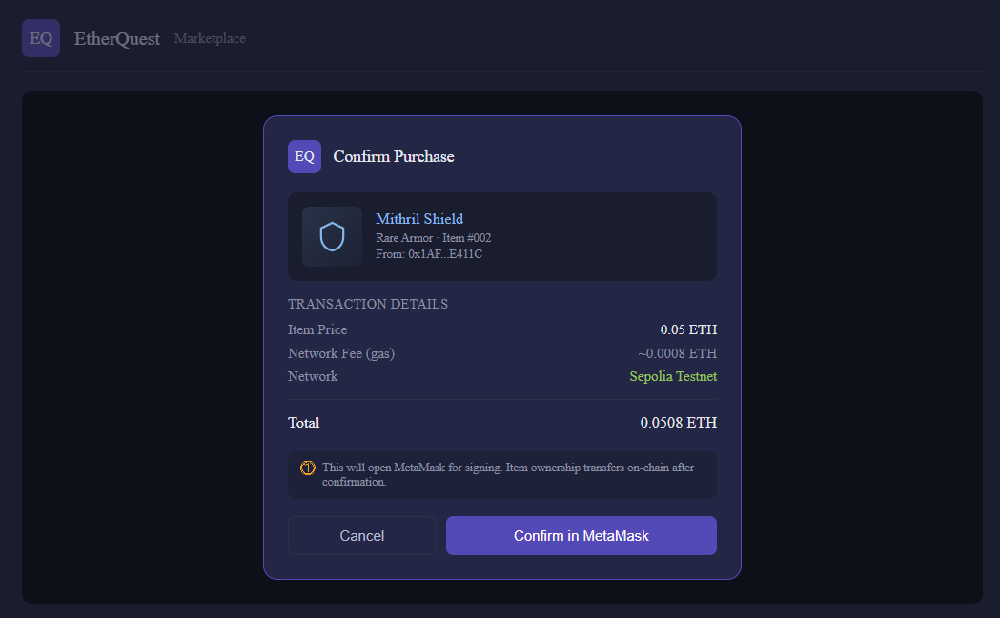

# EtherQuest UI Mockups

These mockups represent the player-facing game UI that would interact with our smart contract. The actual game frontend would be built in HTML5/WebGL by a game studio; these mockups demonstrate the user experience the contract enables.

## 1. Inventory Screen

The player's inventory pulls real ownership data directly from the smart contract via the `getMyInventory()` and `getItem()` view functions. Each item's stats, rarity, and metadata come from on-chain storage. The "Last sync: 2s ago" indicator shows the inventory is reading from the blockchain in real-time.

**Smart contract functions used:**
- `getMyInventory()` — returns array of item IDs owned by the player
- `getItem(uint256)` — returns full item data for each ID

## 2. Marketplace Screen

The marketplace shows all items currently for sale across the entire player base. Players see item stats, rarity, and pricing. The "Buy Now" button triggers a MetaMask transaction that calls the contract's `buyItem()` payable function. Items the player already owns show as "Owned" instead of being purchasable.

**Smart contract functions used:**
- `items` mapping (read-all listings)
- `buyItem(uint256)` payable — transfers ETH to seller and ownership to buyer

## 3. Purchase Confirmation

Before sending the transaction, the game shows a clear summary of what's about to happen: item, price, gas fee, and network. This is critical UX because blockchain transactions are irreversible. The "Confirm in MetaMask" button hands off to the wallet for the actual signature.

**Smart contract functions used:**
- `buyItem(uint256)` payable — the transaction being prepared